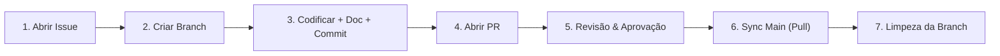

# Fluxo Canônico de Desenvolvimento Git

> **Regra Obrigatória da Organização:** Todo trabalho técnico em qualquer repositório soberano DEVE seguir rigorosamente este ciclo de 7 etapas. É estritamente proibido efetuar alterações diretas na branch `main` ou em pastas internas de dependências de outros projetos.



---

## As 7 Etapas do Ciclo

### 1. Abrir Issue
- Antes de qualquer alteração de código, registrar a demanda (feature, bugfix ou melhoria) no repositório onde a alteração realmente pertence.
- Definir escopo claro, critérios de aceitação e impactos esperados.

### 2. Criar Branch de Trabalho
- Criar a branch de trabalho a partir da `main` atualizada:
  ```bash
  git checkout main
  git pull origin main
  git checkout -b feat/issue-<numero>-<descricao-curta>
  # ou fix/issue-<numero>-<descricao-curta>
  ```

### 3. Codificar + Documentar + Commitar
- Implementar as alterações de código e seus respectivos testes automatizados.
- **Atualização de Documentação Obrigatória:** Registrar decisões, novos conceitos ou regras na pasta `.project/memory/` do próprio repositório.
- Validar a conformidade do acervo executando:
  ```bash
  python .project/okf-index.py
  python .project/okf-gate.py
  ```
- Realizar commits atômicos com mensagens claras e semânticas.

### 4. Abrir Pull Request (PR)
- Fazer push da branch para o repositório remoto (`origin`).
- Abrir o PR apontando para a branch `main`, referenciando o número da issue criada (ex: `Fixes #12`).

### 5. Revisão e Aprovação
- O mantenedor do projeto revisa o código, os testes e a documentação OKF anexada.
- O PR só é mergeado após aprovação formal do responsável pelo repositório.

### 6. Sincronizar da Main
- Após o merge, o ambiente local deve ser sincronizado com a `main`:
  ```bash
  git checkout main
  git pull origin main
  ```

### 7. Limpeza do Ambiente (Local & Remoto)
- Excluir a branch de trabalho temporária tanto localmente quanto no remote para manter a árvore sempre enxuta:
  ```bash
  git branch -d feat/issue-<numero>-<descricao-curta>
  git push origin --delete feat/issue-<numero>-<descricao-curta>
  ```

---

## Dependências Compartilhadas entre Projetos

Se um projeto (ex: `OData`) depender de uma evolução em outro projeto (ex: `FluentSQL`):
- O ciclo acima deve ser executado **dentro do repositório da dependência** (`FluentSQL`).
- Somente após o PR da dependência ser aprovado e mergeado na sua respectiva `main`, o projeto consumidor atualiza seu apontamento e segue o seu próprio ciclo de 7 passos.
