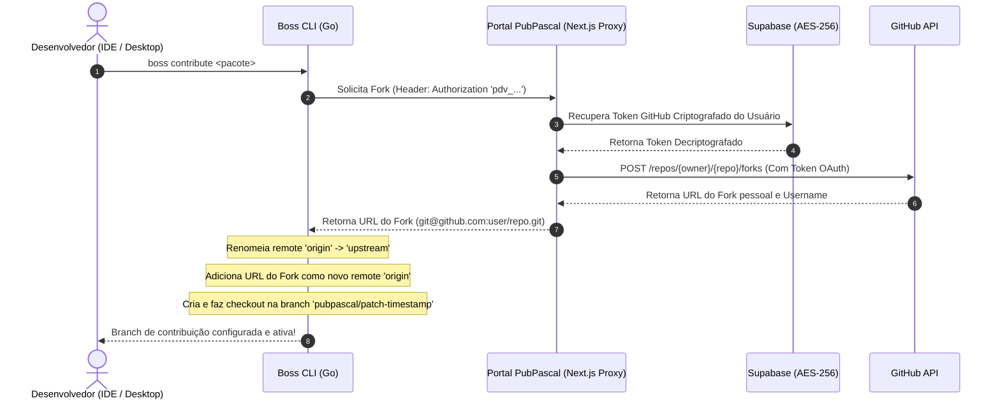

# ADR 002: Fluxo de Contribuição Fluida (Dev-Flow) e Integração Segura com Git/GitHub

## Status
**Aprovado** (Approved)

---

## 1. Contexto e Problema

No ecossistema tradicional de gerenciamento de dependências Pascal (como o Boss original), a contribuição de correções ou melhorias em pacotes de terceiros (localizados em subdiretórios de módulos como `.modules/` ou `modules/`) exige um fluxo manual altamente burocrático por parte do desenvolvedor:
1. Navegar até a página do repositório original no GitHub e realizar um Fork manual para sua conta pessoal.
2. Ir ao terminal local e renomear o remote `origin` original para `upstream` dentro da pasta física da dependência.
3. Adicionar o repositório do seu fork pessoal como o novo remote `origin`.
4. Criar e alternar para uma branch de correção dedicada.
5. Efetuar as alterações de código, realizar os commits, e fazer o push da branch para o seu fork pessoal (`origin`).
6. Retornar ao navegador, abrir a interface web do GitHub, localizar a branch enviada e preencher manualmente o formulário para abrir o Pull Request (PR) contra o repositório principal (`upstream`).

Esse processo fragmentado de 6 etapas cria um grande atrito físico e desencoraja a manutenção de pacotes no ecossistema, reduzindo a velocidade de evolução de bibliotecas críticas de infraestrutura.

---

## 2. Decisões Arquiteturais

Para eliminar esse atrito e permitir que a contribuição de pacotes ocorra em **um único clique** diretamente de dentro do ambiente do desenvolvedor (IDE Delphi/Lazarus ou aplicativo de cockpit do Desktop), adotamos as seguintes decisões de design de arquitetura de software:

### A. Isolamento de Credenciais OAuth via Proxy Criptográfico (Portal Web)
* **Regra de Segurança**: O token pessoal de acesso do desenvolvedor no GitHub **nunca** deve ser armazenado na máquina local em texto plano, nem trafegar em comandos da CLI ou ser injetado em scripts locais.
* **Mecanismo**:
  1. O desenvolvedor conecta sua conta do GitHub uma única vez no Portal Web do PubPascal.
  2. O token de acesso OAuth é armazenado de forma estritamente criptografada no banco de dados (Supabase) utilizando criptografia simétrica **AES-256** (via `pgsodium` / chaves de criptografia gerenciadas).
  3. O desenvolvedor gera no portal um token de identidade de baixo privilégio do PubPascal (`pdv_...`).
  4. O CLI local utiliza exclusivamente o token `pdv_...` para se autenticar contra o portal (`boss login --token pdv_...`), que o armazena de forma segura no arquivo de configuração local (`env.json`).
  5. As chamadas à API do GitHub que exigem alta permissão de escrita (criar forks e abrir PRs) são processadas pelo **Portal Web atuando como um Proxy de Segurança**. O portal autentica a requisição local da CLI, valida o token `pdv_...`, decodifica o token do GitHub correspondente no banco e efetua a chamada à API do GitHub de servidor para servidor.

### B. Mecânica Automatizada de Remotes e Branching Git (CLI em Go)
* **Comando `boss contribute <package>`**:
  * Ao ser executado em um repositório clonado localmente, a CLI em Go realiza as seguintes operações Git nativas em segundo plano:
    1. Verifica se o remote `upstream` já existe. Se não existir, renomeia o remote `origin` ativo para `upstream`.
    2. Envia uma requisição de autenticação para a rota `/api/packages/contribute/fork` do portal para criar o fork do pacote de forma assíncrona.
    3. Recebendo a URL de clone do fork pessoal do usuário, a CLI adiciona essa URL como o novo remote `origin`.
    4. Gera uma branch de trabalho dedicada seguindo o padrão de nomenclatura rígido:
       `pubpascal/patch-<timestamp_unix>` (ex: `pubpascal/patch-1719435600`).
    5. Realiza o checkout local para essa nova branch de trabalho.
  * O desenvolvedor entra instantaneamente no "Modo de Contribuição Ativo", onde qualquer alteração e commit local feitos sob essa dependência estarão isolados do histórico principal.

### C. Geração Inteligente e Envio de Pull Request (`boss contribute <package> --pr`)
* **Comando `boss contribute <package> --pr`**:
  * Quando o desenvolvedor conclui as correções e deseja submeter seu código para avaliação do mantenedor original, o uso da flag `--pr` dispara as seguintes automações:
    1. A CLI local executa o envio da branch para o fork do desenvolvedor:
       `git push origin pubpascal/patch-<timestamp_unix>`.
    2. A CLI lê de forma autônoma o histórico local da branch para extrair a mensagem (título e corpo) do **último commit** realizado pelo desenvolvedor.
    3. Envia uma requisição de escrita para a rota `/api/packages/contribute/pr` do portal contendo:
       * A branch de origem (`pubpascal/patch-<timestamp_unix>`).
       * A branch de destino padrão do repositório upstream (normalmente `main` ou `master`).
       * O título e a descrição extraídos do último commit.
    4. O portal cria o Pull Request no GitHub por meio do proxy seguro e retorna a URL pública do PR gerado (ex: `https://github.com/HashLoad/horse/pull/123`).
    5. A CLI reporta o sucesso no console e, na camada visual (IDE/Desktop), invoca a API do sistema operacional `ShellExecute` para **abrir automaticamente o navegador padrão do desenvolvedor diretamente na página do PR recém-criado**, permitindo a revisão visual imediata.

### D. Escolha de Modo de Trabalho no Clone (Estável vs Contribuição)
* **Design de Fluxo**: No momento em que o desenvolvedor escolhe clonar um workspace, o aplicativo apresenta um diálogo interativo oferecendo duas opções de trabalho distintas:
  1. **Apenas Usar (Modo Estável)**: Clona os repositórios oficiais estáveis. Não exige que o desenvolvedor esteja logado ou tenha chaves do GitHub vinculadas. O CLI do Boss baixa os manifestos de workspaces públicos de forma anônima.
  2. **Contribuir (Modo Desenvolvedor)**: Prepara o ambiente para envio de Pull Requests. Se o desenvolvedor escolher essa opção e não estiver logado, o aplicativo abre automaticamente a barra lateral retrátil nativa (VCL) de login para solicitar a autenticação do token do portal.
* **Flexibilidade Evolutiva**: Caso o desenvolvedor inicie clonando em modo estável e depois decida alterar uma dependência, ele poderá elevá-la a qualquer momento ao modo contribuição individualmente clicando em "Contribuir".

---

## 3. Definição do Formato de Manifestos e Sincronia

O fluxo de contribuição suporta de forma transparente o modelo de sincronização de metadados estabelecido na **ADR 001**:
* **Uso de Dependências Canônicas**: O resolvedor de dependências da CLI realiza a normalização de hosts (ex: remove prefixos como `github.com/` ou `gitlab.com/`) no portal, assegurando que o grafo de dependências recursivas exibido visualmente no cockpit do desktop (WebView) reflita exatamente a relação lógica dos pacotes, independentemente de estarem apontando temporariamente para forks pessoais (`origin`) ou repositórios oficiais (`upstream`) no Git local.
* **Independência de Versões**: O sistema preserva o controle de pins de versão no `boss.json` original. Ao ativar o modo de contribuição, a versão definida no manifesto principal do projeto que consome a dependência permanece inalterada, evitando que alterações locais em branches quebrem builds de outros membros da equipe de desenvolvimento.

---

## 4. Consequências e Benefícios

### A. Consequências Positivas
* **Atrito Zero**: O desenvolvedor não precisa gerenciar chaves SSH do GitHub, URLs de forks ou manipulação complexa de remotes no terminal. Todo o ciclo ocorre de forma automatizada por baixo do capô.
* **Segurança Reforçada**: Nenhum token do GitHub é persistido ou exposto na máquina do desenvolvedor. A revogação do acesso ao portal (`boss logout`) remove imediatamente a capacidade de qualquer agente local interagir com a API do GitHub em nome do usuário.
* **Rastreabilidade**: O Portal Web PubPascal pode auditar os PRs submetidos através da plataforma, garantindo conformidade com regras corporativas de segurança e políticas de código aberto.
* **Compatibilidade com IDEs**: A execução de todas as etapas Git em threads secundárias (`TThread.CreateAnonymousThread`) na IDE Delphi garante que o ambiente de design nunca congele durante as operações de rede.

### B. Consequências Negativas / Trade-offs
* **Dependência do Portal**: Para efetuar contribuições em 1 clique, o desenvolvedor precisa obrigatoriamente estar autenticado com um token ativo do Portal PubPascal. Caso o portal esteja offline, o desenvolvedor precisa recorrer ao fluxo Git manual tradicional (o que continua sendo 100% suportado pelo fato do ecossistema de remotes do Git local permanecer padrão).
